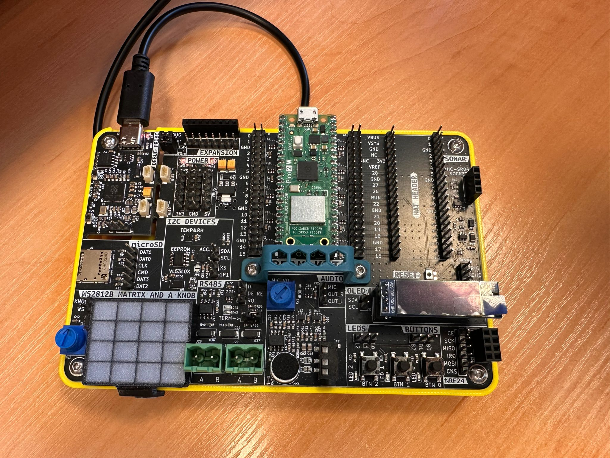

# Raspberry Pi Pico 2 W – Laboratory Projects

A collection of embedded systems laboratory exercises developed using the **Raspberry Pi Pico 2 W** platform.  
The projects focus on low-level embedded programming, hardware interfacing, communication protocols, and real-time systems concepts.

The classes were prepared by the instructor Mateusz Szpetkowski from Wrocław UNiversity of Science & Technology.
---

## Preview

---

## About

These laboratory projects were created as part of embedded systems coursework using the **Raspberry Pi Pico 2 W** microcontroller board based on the RP2350 architecture.

The exercises introduce practical aspects of:
- Embedded C/C++ programming
- GPIO and peripheral control
- Hardware communication protocols
- Sensor interfacing
- Wireless embedded applications

---

# Laboratory Exercises

## Lab 2 – GPIO and Digital I/O

Introduction to fundamental microcontroller operations and digital signal handling.

### Topics
- GPIO configuration
- LED control
- Push-button input
- Timing and delays
- Basic embedded debugging

---

## Lab 3 – Communication Interfaces

Implementation of common embedded communication protocols.

### Topics
- UART communication
- SPI communication
- I2C communication
- Serial debugging
- Peripheral interfacing

---

## Lab 4 – Sensors and Data Acquisition

Working with external sensors and analog signal processing.

### Topics
- ADC (Analog-to-Digital Conversion)
- Sensor integration
- Signal acquisition
- Real-time measurement systems
- Data processing

---

## Lab 5 – Wireless and Edge Computing

Introduction to wireless communication and lightweight edge-device applications.

### Topics
- Wi-Fi functionality
- Bluetooth communication
- Embedded networking basics
- Edge computing concepts
- Real-time wireless communication

---

# Technologies Used

- Raspberry Pi Pico 2 W
- RP2350 Microcontroller
- Embedded C/C++
- VS Code
- UART / SPI / I2C
- GPIO Programming
- ADC Interfaces
- Serial Debugging

---

# Related Website

https://edge-intelligence.pl

